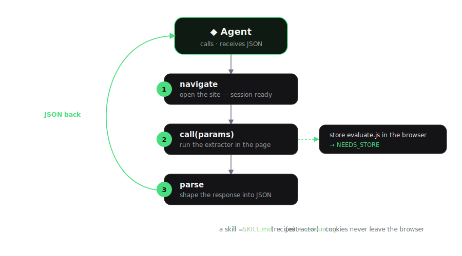

<p align="center">
  <a href="https://browser-memory.com">
    
  </a>
</p>

<p align="center">
  <b>Open catalog of web skills for AI agents.</b>
</p>

<p align="center">
  <a href="https://www.npmjs.com/package/bmem-cli"></a>
  <a href="./LICENSE"></a>
  <a href="https://browser-memory.com"></a>
  <a href="https://github.com/browser-memory/browser-memory"></a>
</p>

`bmem` is a thin, consume-only CLI (Node, no browser) for an open catalog of reusable,
battle-tested web skills. It searches the catalog and registers skills into your agent's
native skill framework — then your agent runs them with **whatever browser it already
has** (Playwright MCP, claude-in-chrome, Puppeteer, …). It never drives a browser and
never sees your cookies: the agent runs the skill with its own browser, so the session
stays put.

## Quickstart

Install the CLI, bootstrap your agent once with `bmem install`, then add any skill from
the catalog — it shows up in your agent's native skill list and runs with its own browser.

```bash
npm i -g bmem-cli
bmem install
bmem add linkedin.com/get-profile   # one skill
bmem add linkedin                   # every linkedin.com skill at once
```

Requires Node.js 20 or newer, with `npx` available.

## Commands

| Command | What it does |
| --- | --- |
| `bmem search <query>` | Search the catalog. `--site linkedin.com` to filter by site |
| `bmem list` | List the whole catalog. `--limit 50` to cap results |
| `bmem show <skill>` | Print a skill's `SKILL.md` without installing it |
| `bmem add <skill>` | Download + register a skill natively. **Global by default**; `--no-global` for project scope |
| `bmem add <site>` | A bare site (`linkedin`, `doordash.com`) adds **every** skill the site has, one by one |
| `bmem update [skill]` | Re-fetch installed skills and re-register the ones that changed. Omit the name to update all |
| `bmem install` | Register the bundled **meta-skill** that teaches your agent the commands and how to map skill capabilities to its own browser tools |

> `add`, `update` and `install` delegate to the standalone [`skills`](https://www.npmjs.com/package/skills)
> installer (`npx skills add …`), which detects your agent (Claude Code, Cursor, …).

## How a skill runs

<p align="center">
  
</p>

## Sites

<p align="center">
  <a href="https://browser-memory.com/ecosystem/linkedin.com"></a>
  <a href="https://browser-memory.com/ecosystem/x.com"></a>
  <a href="https://browser-memory.com/ecosystem/github.com"></a>
  <a href="https://browser-memory.com/ecosystem/doordash.com"></a>
  <a href="https://browser-memory.com/ecosystem/reddit.com"></a>
  <a href="https://browser-memory.com/ecosystem/airbnb.com"></a>
  <a href="https://browser-memory.com/ecosystem/amazon.com"></a>
  <a href="https://browser-memory.com/ecosystem/youtube.com"></a>
  <a href="https://browser-memory.com/ecosystem/booking.com"></a>
  <a href="https://browser-memory.com/ecosystem/ebay.com"></a>
  <a href="https://browser-memory.com/ecosystem/yelp.com"></a>
</p>

## Configuration

| Env var                     | Default          | Purpose                        |
| --------------------------- | ---------------- | ------------------------------ |
| `BMEM_SKILLS_API_BASE_URL`  | `https://api.browser-memory.com` | Skills API base (self-host) |
| `BMEM_HOME`                 | `~/.config/bmem` | Local cache of added skills    |

## License

MIT
